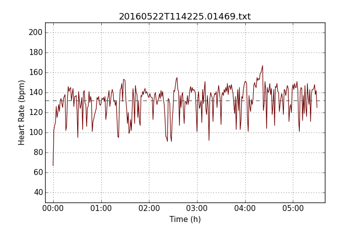
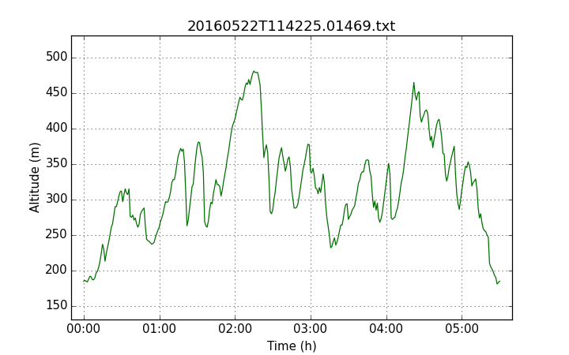
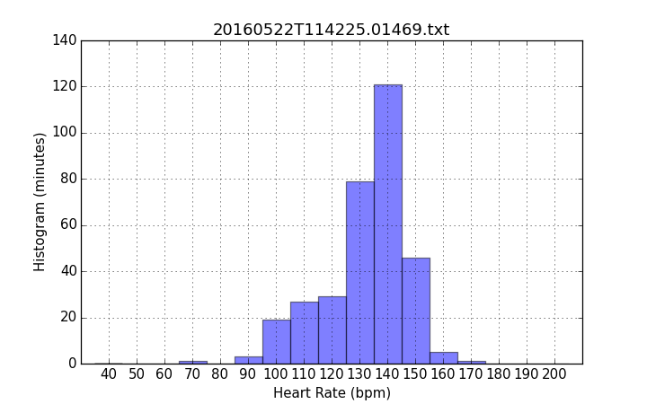

s725
====

### About

Communicate with Polar S725X heart rate monitor via IR interfaces.
This project is based on s710 from http://code.google.com/p/s710/.

### Building

Building s725 requires make, gcc/clang, flex,
yacc/byacc/bison:

	# Debian/Ubuntu
	apt-get install gcc make flex bison
	make

	# Fedora
	dnf install gcc make flex byacc
	make

    # OpenBSD
	make

s725 has been tested on the following systems:

 * Ubuntu 16.04 amd64 with both USB/FTDI/IRXON and builtin IR
 * Fedora 23 amd64 with both USB/FTDI/IRXON and builtin IR
 * Debian GNU/Linux 8.0 amd64 with USB/FTDI/IRXON
 * OpenBSD-current amd64 (May 2016) with USB/FTDI/IRXON
 * OpenBSD 5.9 sparc64 with USB/FTDI/IRXON
 * OpenBSD 5.9 hppa with serial/IRXON
 * OpenBSD 5.9 alpha with serial/IRXON

### Usage

The s725get utility takes a -d argument which specifies the driver
type to be used to communicate with the device.  Valid values are
"serial", "irda". A device filename is required for -d values
of "serial", but not for "irda". The default is -d serial.

Examples:

	s725get -d serial -D /dev/cua00 -o tcx
	s725get -d serial -D /dev/ttyUSB0 -o hrm

You must have write permissions for the device file to use s725get.

Downloaded workout files are stored in the current directory by
default. To change this, you can pass the -f command line option to
s725get:

	s725get -f ~/workout/

s725get reads the configuration file ~/.s725rc, which might contain
the following settings:

	#
	# ~/.s725rc
	#

	# driver. possible values: serial, irda
	driver = serial

	# device file name
	device = "/dev/cuaU0"

    # output directory
    directory = "/home/user/polar/data/"

    # output format
    format = tcx

There are two ways to transfer data from the S725X watch:
Put the watch into "Connect" mode, put it next to the IR interface
and run s725get like this:

    [user@host ~]$ s725get -d serial -D /dev/ttyUSB0 -f tmp -o txt
    Reading [19163 bytes] [########################################] [  100%]
    File 01: Saved as /home/user/tmp/20160503T180809.03621.txt
    File 02: Saved as /home/user/tmp/20160501T215815.00149.txt
    File 03: Saved as /home/user/tmp/20160428T173144.01881.txt
    File 04: Saved as /home/user/tmp/20160426T181506.01677.txt
    File 05: Saved as /home/user/tmp/20160302T102256.07165.txt
    File 06: Saved as /home/user/tmp/20151103T140918.01129.txt
    File 07: Saved as /home/user/tmp/20150829T093131.03392.txt
    File 08: Saved as /home/user/tmp/20150813T180106.00149.txt
    Saved 8 files

This way the IR interface sends a "get" command and then waits for
data to arrive.  The second option is to run s725get in listen mode,
put the S725X watch into connect mode and select the file to transfer:

    [user@host ~]$ s725get -d serial -D /dev/ttyUSB0 -f tmp -o txt -l
    Reading [456 bytes] [########################################] [  100%]
    File 01: Saved as /home/user/tmp/20160501T215815.00149.txt
    Saved 1 files

### Drivers

#### serial

This driver is known to work with:

 * Serial infrared adapter IRXON SMH-IR220 attached via USB serial adapter
   http://www.irxon.com/english/products/ir220_e.htm
 * Builtin Fujitsu Lifebook T4215 IR interface in IrDA mode (see BIOS
   setup) that is accessed like a standard serial port

#### irda

This driver uses the Linux IrDA stack to talk to a Polar HRM.

The S725X has two modes. The mode used by the serial driver
respond to request frames containing a type field, len field and
crc. In IrDA mode, the watch responds to discovery request from the
IrDA host. The IrDA stack takes care of ensuring data transmissing,
framing and checksums.

After enabling the infrared interface on the Linux host and running
irattach, the watch should appear in /proc/net/irda/discovery:

	$ cat /proc/net/irda/discovery 
	IrLMP: Discovery log:
	
	nickname: Polar S725X, hint: 0x8204, saddr: 0xa1a6cc7c, daddr: 0x3fcbdfde

When this works, the s725get tool can be used like this:

	$ s725get -d irda -t
	2016-05-07T10:24:46

This driver is work in progress and currently only works for simple
requests, (like -t to query the time and date).

### s725plot

Script to plot heart rate over time, altitude over time and heart rate
histogram. Requires Python 2.7 or Python 3, matplotlib (tested
with 1.4) and numpy. Input has to be in 'txt' format as written by
s725get or hrmtool.

#### Usage

	Usage: s725plot <INPUT> <OUTPUT DIRECTORY>

#### Examples

